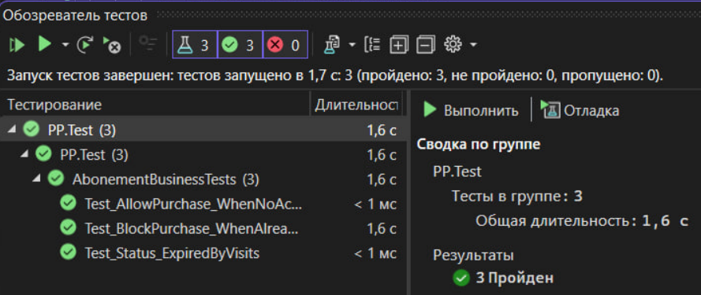

# Тестирование

Процесс тестирования разработанной информационной системы управления бассейном является критически важным этапом, направленным на подтверждение соответствия программного продукта заявленным функциональным требованиям,  
а также на обеспечение надежности и отказоустойчивости системы при работе с данными клиентов. Тестирование проводилось по двухуровневой модели, включающей модульное и интеграционное исследование программной логики.

### 10.1. Модульное тестирование

Модульное тестирование было ориентировано на проверку изолированных компонентов программного кода, ответственных за ключевую бизнес-логику приложения.   
Основная цель данного этапа – гарантировать корректность работы алгоритмов без учета их взаимодействия с внешними системами или базой данных.

В рамках модульного тестирования с использованием фреймворка MSTest был проверен следующий механизм:  
**Условная логика управления доступом:** проверка системы принятия решений о возможности продажи новой подписки на основе текущего статуса клиента (блокировка дублирующих абонементов).

Изоляция проверяемых методов позволила выявить и устранить логические ошибки на ранних этапах, обеспечив стабильную работу ядра системы.

| ID | Описание | Шаги | Результат |
|----|----------|------|-----------|
| T1 | Проверка возможности продажи при отсутствии активных подписок | 1. Выбрать клиента без абонемента.   2. Вызвать проверку CanPurchase. | Метод возвращает True. Ошибки отсутствуют. Продажа разрешена. |
| T2 | Проверка блокировки при наличии активного абонемента | 1. Выбрать клиента, у которого активен абонемент.  2. Попытаться оформить покупку. | Метод возвращает False. Выводится сообщение: "У клиента уже есть действующий абонемент". |
| T3 | Проверка статуса при нулевом балансе визитов | 1. Передать в метод дату в будущем и количество визитов "0". | Система присваивает статус "Визиты исчерпаны". |
| T4 | Проверка статуса при истекшей дате | 1. Передать дату (Вчера) и количество визитов "5". | Система присваивает статус "Истек по дате". |

### 10.2. Интеграционное тестирование

После успешного завершения модульных проверок было проведено интеграционное тестирование. Его целью стала верификация корректности взаимодействия между различными функциональными модулями системы.

Для визуального анализа полноты покрытия интеграционных связей был использован метод построения ориентированного графа состояний, который отображает все возможные переходы пользователя внутри системы и взаимодействия между экранными формами.

Для работы по тестовому графу необходимо составить тестовые пути, по которым будет тестироваться программа.  
Тестовые пути по разработанной программе выглядят следующим образом:  
* Т1: 1-2-17
* Т2: 1-2-3-17
* Т3: 1-2-3-4-3-17
* Т4: 1-2-3-4-5-4-3-17
* Т5: 1-2-3-4-5-4-7-4-3-17
* Т6: 1-2-3-4-6-4-3-17
* Т7: 1-2-3-4-7-4-3-17
* Т8: 1-2-3-8-3-17
* Т9: 1-2-3-8-9-8-3-17
* Т10: 1-2-3-8-10-8-3-17
* Т11: 1-2-3-11-3-17
* Т12:1-2-3-11-12-11-3-17
* Т13: 1-2-3-13-3-17
* Т14: 1-2-3-13-14-13-3-17
* Т15: 1-2-3-15-3-17
* Т16: 1-2-3-16-3-17

Данные для интеграционного тестирования представлены в таблице:

| ID | Исходные данные | Цель | Описание | Ожидаемый результат | Полученный результат |
|----|---------------------|------|-----------------|--------------------|---------------------|
| T1 | Система запущена. Окно авторизации активно. | Проверка корректного появления окна авторизации на стартовой странице. | 1. Запустить приложение.   2. Дождаться появления окна авторизации.   3. Нажать кнопку "Закрыть" (или крестик окна). | Приложение полностью завершает работу. | Проведен |
| T2 | Успешная авторизация в системе. Активно главное меню. | Проверка выхода из приложения из главного меню. | 1. Запустить приложение.  2. Выполнить успешную авторизацию.  3. Находясь в главном меню, нажать кнопку "Выход". | Приложение полностью завершает работу. | Проведен |
| T3 | Успешная авторизация в системе. Активно главное меню. | Проверка перехода к списку клиентов и возврата в главное меню. | 1. Запустить приложение.  2. Выполнить успешную авторизацию.  3. В главном меню нажать кнопку "Клиенты".  4. Дождаться появления окна просмотра клиентов.  5. Нажать кнопку "Назад" или "Закрыть". | Произойдет переход к окну клиентов, затем успешный возврат в главное меню (3). | Проведен |
| T4 | Существующий клиент в базе данных. | Проверка цикла создания/редактирования клиента. | 1. Запустить приложение.  2. Выполнить успешную авторизацию.  3. В главном меню перейти в окно просмотра клиентов.  4. Нажать кнопку "Добавить клиента" или "Редактировать клиента".  5. Заполнить данные в окне.  6. Нажать "Сохранить".  7. Дождаться возврата в окно просмотра клиентов. | Новый клиент добавлен/существующий изменен.  Данные отображаются в списке. | Проведен |
| T5 | Существующий клиент в базе данных, не имеющий активного абонента. | Проверка полного цикла создания абонента. | 1. Запустить приложение.  2. Выполнить успешную авторизацию.  3. В главном окне просмотра клиентов нажать "Сохранить".  6. Дождаться возврата в окно просмотра клиентов. | Новый клиент создан и абонент оформлен и привязан к клиенту. Обновленная информация видна в списке клиентов. | Проведен |
| T6 | Существующий клиент в базе данных, имеющий историю посещений. | Проверка просмотра истории посещений клиента. | 1. Запустить приложение.  2. Выполнить успешную авторизацию.  3. В главном меню перейти в окно просмотра клиентов.  4. Выбрать клиента из списка.  5. Нажать кнопку "История посещений".  6. Дождаться возврата в окно просмотра клиентов. | Открывается окно истории посещений, содержащее данные. Происходит возврат в окно просмотра клиентов. | Проведен |
| T7 | Существующий клиент в базе данных, имеющий активный абонент. | Проверка продажи абонента. | 1. Запустить приложение.  2. Выполнить успешную авторизацию.  3. В главном окне просмотра клиентов нажать "Сохранить".  6. Дождаться возврата в окно просмотра клиентов. | Абонент оформлен и привязан к клиенту. Обновленная информация видна в списке клиентов. | Проведен |
| T8 | Успешная авторизация в системе. Активно главное меню. | Проверка навигации к списку и просмотра тренеров. | 1. Запустить приложение.  2. Выполнить успешную авторизацию.  3. Находясь в главном меню, нажать кнопку "Тренеры".  4. Дождаться появления окна просмотра тренеров.  5. Нажать кнопку "Назад" или "Закрыть". | Произойдет переход к окну тренеров, затем успешный возврат в главное меню (3). | Проведен |
| T9 | Существующий тренер в базе данных. | Проверка цикла создания/редактирования тренера. | 1. Запустить приложение.  2. Выполнить успешную авторизацию.  3. В главном меню перейти в окно просмотра тренеров.  4. Нажать кнопку "Добавить тренера".  5. Заполнить данные в окне.  6. Нажать "Сохранить".  7. Дождаться возврата в окно просмотра тренеров. | Новый тренер добавлен/изменен. Данные корректно отображаются в списке. | Проведен |
| T10 | Существующий тренер в базе данных, имеющий расписание. Проверка просмотра графика работы тренера. | 1. Запустить приложение.  2. Выполнить успешную авторизацию.  3. В главном меню перейти в окно просмотра тренеров.  4. Выбрать тренера из списка, дождавшись появления окна графика работы тренера.  5. В главном меню с данными тренера нажать кнопку "Закрыть" или "Назад". | Открывается окно графика работы тренера, содержащее корректные данные. Дождаться появления окна просмотра тренеров. |
| T11 | Успешная авторизация в системе. Активно главное меню. | Проверка навигации к списку абонементов и главному меню. | 1. Запустить приложение.  2. Выполнить успешную авторизацию.  3. В главном меню нажать кнопку "Абонементы".  4. Дождаться появления окна просмотра абонементов.  5. В главном меню нажать кнопку "Назад" или "Вернуться в главное меню". | Произойдет переход к просмотру абонементов, затем успешный возврат в главное меню (3). |
| T12 | Существующий шаблон абонемента в базе данных. Проверка цикла создания/редактирования шаблона абонемента. | 1. Запустить приложение.  2. Выполнить успешную авторизацию.  3. В главном меню перейти в окно просмотра абонементов.  5. Нажать кнопку "Добавить" или "Редактировать" в окне, дождаться возврата в окно просмотра абонементов. | Новый абонемент добавлен/изменен. Данные корректно отображаются в списке. |
| T13 | Успешная авторизация в системе. Активно главное меню. | Проверка навигации к расписанию и главному меню. | 1. Запустить приложение.  2. Выполнить успешную авторизацию.  3. В главном меню нажать кнопку "Расписание".  5. Нажать кнопку "Назад" в окне расписания. | Произойдет переход к окну расписания, затем успешный возврат в главное меню. |
| T14 | Существующая запись в расписании. Проверка создания/редактирования записи расписания. | 1. Запустить приложение.  2. Выполнить успешную авторизацию.  3. В главном меню перейти в окно просмотра расписания.  4. Нажать кнопку "Добавить запись" или "Редактировать запись" в окне, дождаться возврата в окно просмотра расписания. | Новая запись в расписании добавлена/изменена. Данные корректно отображаются в расписании. |
| T15 | Успешная авторизация в системе. Активно главное меню. | Проверка просмотра загрузки бассейна. | 1. Запустить приложение.  2. Выполнить успешную авторизацию.  3. В главном меню нажать кнопку "Загрузка бассейна".  4. Дождаться появления окна для просмотра.  5. Нажать кнопку "Назад". | Открывается окно просмотра загрузки бассейна, содержащее актуальные данные. Дождаться появления главного меню. |
| T16 | Успешная авторизация в системе. Активно главное меню. | Проверка просмотра статистики. | 1. Запустить приложение.  2. Выполнить успешную авторизацию.  3. В главном меню нажать кнопку "Статистика".  4. Дождаться появления окна просмотра статистики.  5. Нажать кнопку "Назад". | Открывается окно просмотра статистики, содержащее актуальные данные. Дождаться появления главного меню. |

## Результат тестирования  

Все модульные тесты были успешно пройдены, подтверждая надежность базовой бизнес-логики.   
Интеграционное тестирование не выявило критических ошибок в межмодульном взаимодействии и операциях с базой данных, что свидетельствует о стабильной работе системы в целом.  
Обнаруженные мелкие недочеты в пользовательском интерфейсе были оперативно устранены. Система готова к опытной эксплуатации
