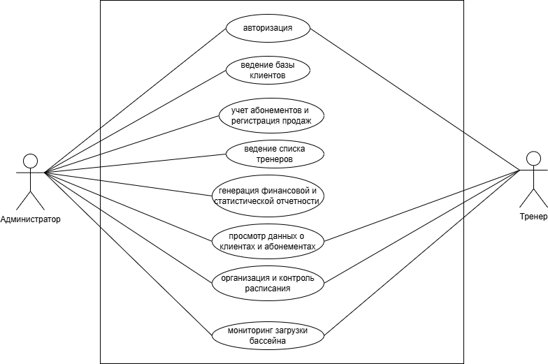

# Построение диаграммы вариантов использования

### Описание диаграммы
На данной UML-диаграмме представлены основные варианты использования системы для двух типов акторов: **Администратора и Тренера.**  
Диаграмма наглядно демонстрирует разграничение прав доступа в АРМ: 

**1. Администратор** – обладает полным набором прав, включая:
  *  Авторизация в системе.
  *  Ведение базы клиентов и списка тренеров.
  *  Учет абонементов и регистрацию продаж.
  *  Генерацию финансовой и статистической отчетности.
  *  Полный контроль расписания.
  *  Мониторинг текущей загрузки бассейна.

**2. Тренер** – имеет доступ только к операционному функционалу:
  *  Авторизация в системе.
  *  Просмотр данных о клиентах и их абонементах (без права удаления).
  *  Организация и контроль расписания (запись клиентов).
  *  Мониторинг текущей загрузки бассейна.

**3. Общие функции** – оба актора используют модули авторизации и мониторинга загрузки для эффективной работы спортивного объекта.
