# 8. Макетирование интерфейса пользователя
Проектирование интерфейса АРМ администратора бассейна основывалось на принципах минимализма, высокой информативности и скорости выполнения задач.  

Для иллюстрации были созданы макеты ключевых экранов, отражающие их функционал и логику взаимодействия.

### 1. Экран авторизации (Authorization)
*  Назначение: Первичная идентификация пользователя.
*  Элементы: Поля для ввода логина и пароля, кнопка "Войти".
*  Макет:

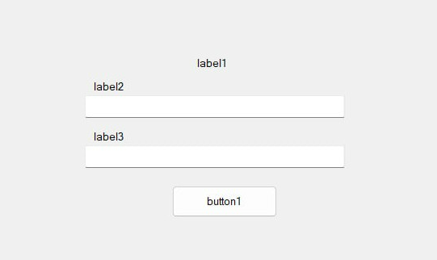
### 2. Главное меню (Menu)
*  Назначение: Центральный узел навигации. Динамически отображает кнопки доступа к модулям.
*  Элементы: Кнопки навигации (Клиенты, Тренеры, Абонементы, Расписание, Статистика, Загрузка бассейна, Выход), индикатор текущей роли пользователя.
*  Макет:

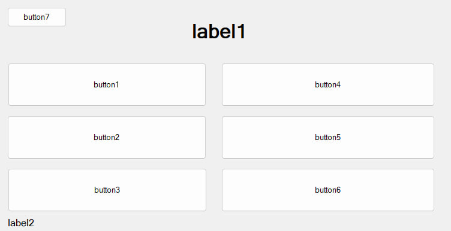
### 3. Список клиентов (Clients)
*  Назначение: Отображение всех зарегистрированных посетителей.
*  Элементы: Таблица DataGridView с данными (ФИО, телефон, статус абонемента), строки поиска, кнопки "Добавить", "Редактировать", "Удалить".
*  Макет:

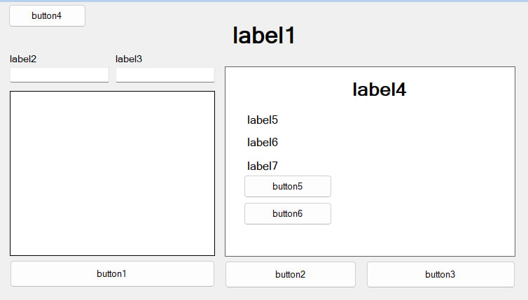
### 4. Детализация клиента (ClientDetail)
*  Назначение: Заполнение полной информации о клиенте и его истории.
*  Элементы: Поля с персональными данными, таблица с историей абонементов (тип, дата покупки, срок действия), кнопка "Назад".
*  Макет:

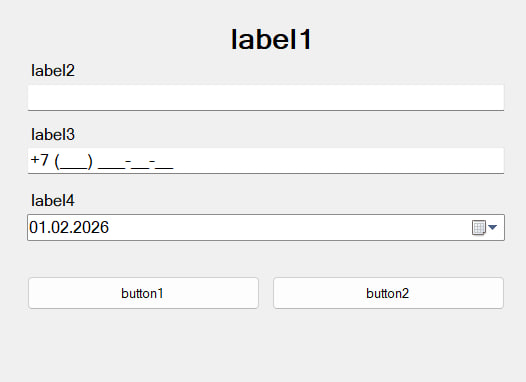
### 5. Список тренеров (Coaches)
*  Назначение: Реестр сотрудников.
*  Элементы: Таблица DataGridView (ФИО, специализация, стаж, дата рождения), кнопки "Добавить", "Редактировать", "Удалить".
*  Макет:

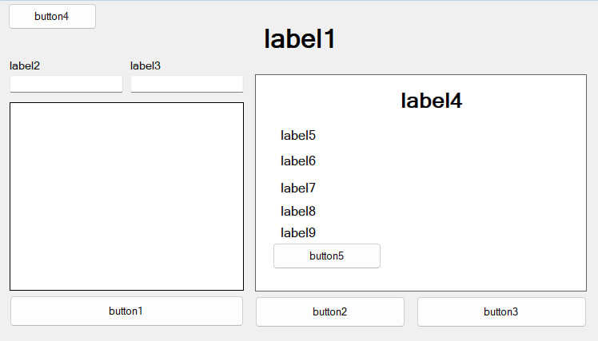
### 6. Детализация тренера (CoachDetail)
*  Назначение: Просмотр и редактирование данных тренера.
*  Элементы: Поля с ФИО, специализацией.
*  Макет:

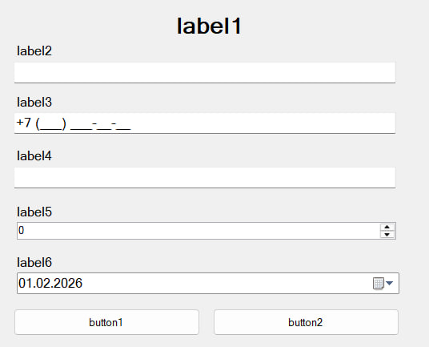
### 7. Список абонементов (Abonements)
*  Назначение: Каталог абонементов и их стоимость.
*  Элементы: Таблица DataGridView (название, цена, срок действия, лимит посещений), кнопки "Добавить", "Редактировать", "Удалить".
*  Макет:

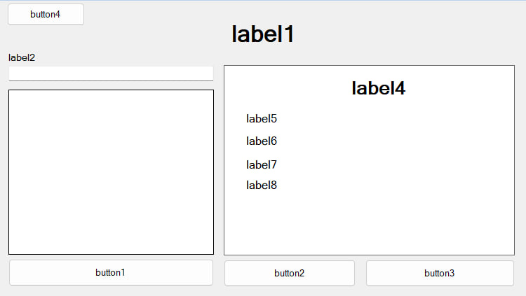
### 8. Продажа абонемента (SellAbonement)
*  Назначение: Регистрация покупки абонемента клиентом.
*  Элементы: Поле выбора клиента, выпадающий список абонементов, автоматический расчет даты окончания, поле суммы, кнопка "Продать".
*  Макет:

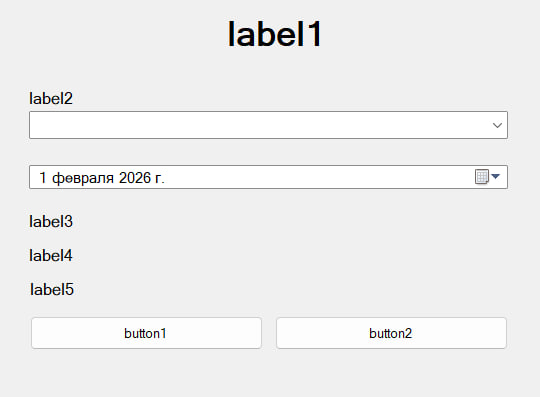
### 9. Детализация абонемента (AbonementDetail)
*  Назначение: Создание и редактирование типов абонементов.
*  Элементы: Поля ввода названия, цены, срока, лимита.
*  Макет:

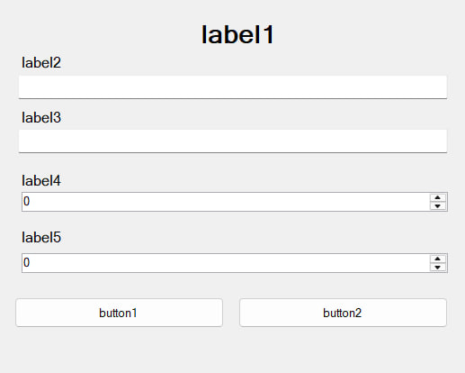
### 10. Расписание (Schedule)
*  Назначение: Основной интерфейс для планирования и контроля занятий.
*  Элементы: Интерактивный календарь, временная сетка с записями (показываются ФИО клиента, тренер, зона), кнопки "Добавить", "Редактировать", "Удалить".
*  Макет:

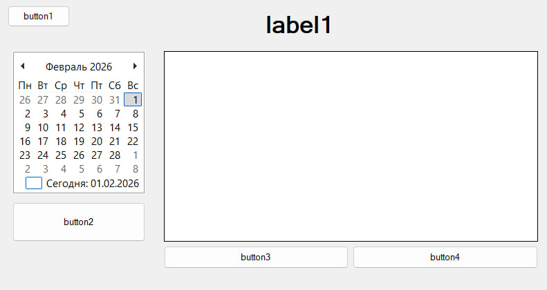
### 11. Детализация записи в расписании (ScheduleDetail)
*  Назначение: Создание или редактирование конкретной записи о занятии.
*  Элементы: Выбор клиента, тренера, зоны бассейна, дата, времени начала/окончания, кнопка "Сохранить".
*  Макет:

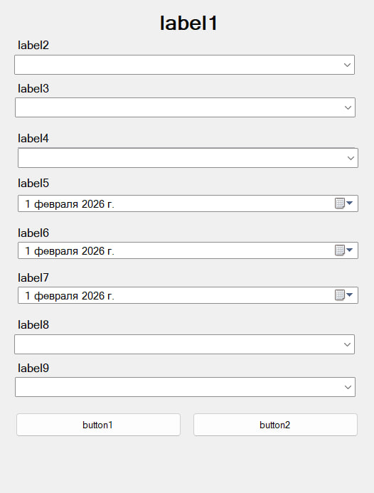
### 12. Индивидуальное расписание тренера (CoachSchedule)
*  Назначение: Просмотр графика конкретного тренера.
*  Элементы: Календарь и временная сетка, отображающая только записи данного тренера.
*  Макет:

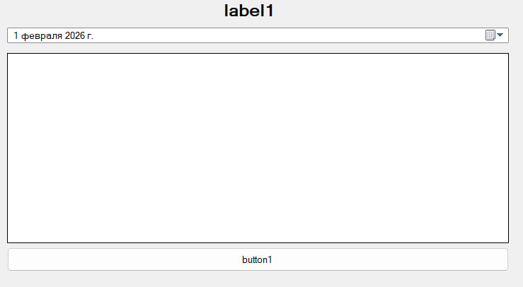
### 13. Мониторинг загрузки бассейна (PoolLoad)
*  Назначение: Отображение текущего количества посетителей по зонам.
*  Элементы: Фильтрация по зонам бассейна, указанное текущее время
*  Макет:

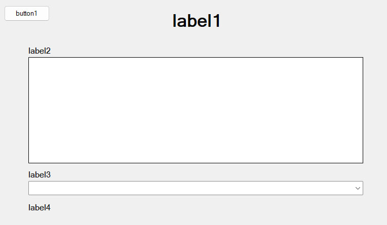
### 14. Статистика (Statistics)
*  Назначение: Анализ финансовых показателей и эффективности работы.
*  Элементы: Выбор периода, графики выручки, таблицы с рейтингом услуг и тренеров.
*  Макет:

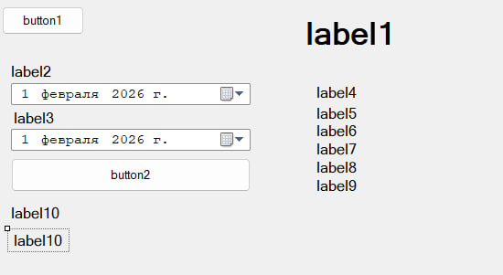

## Формы приложения ##

